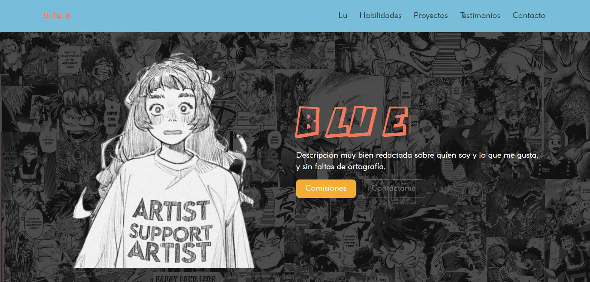
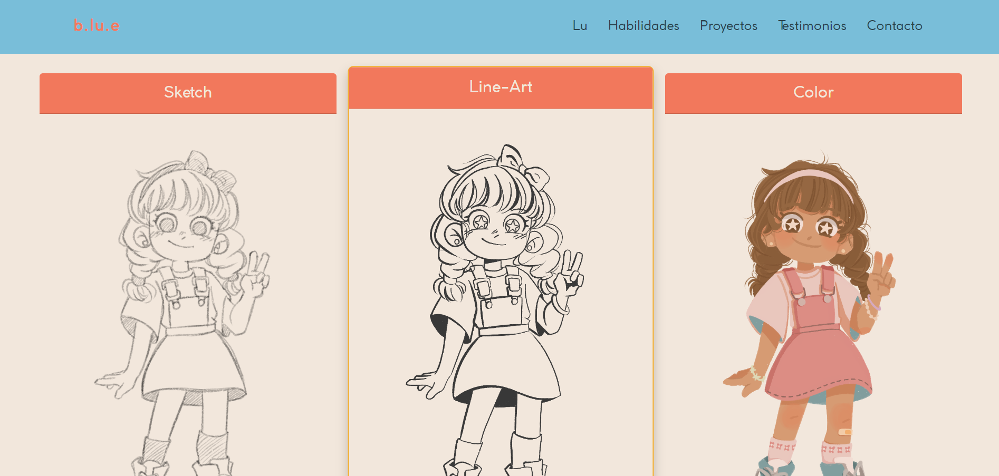
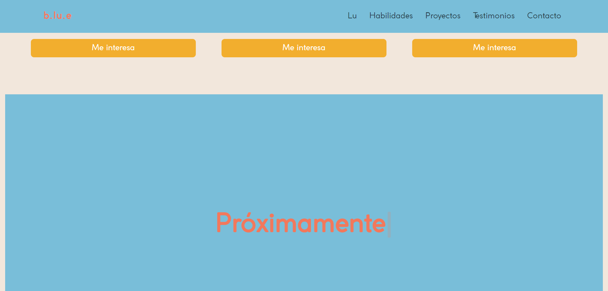
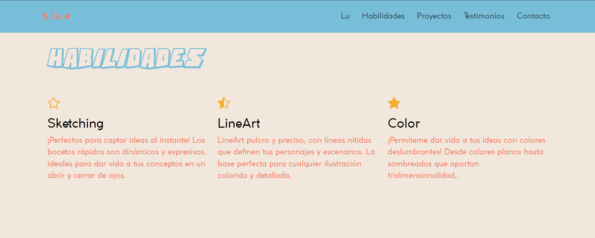
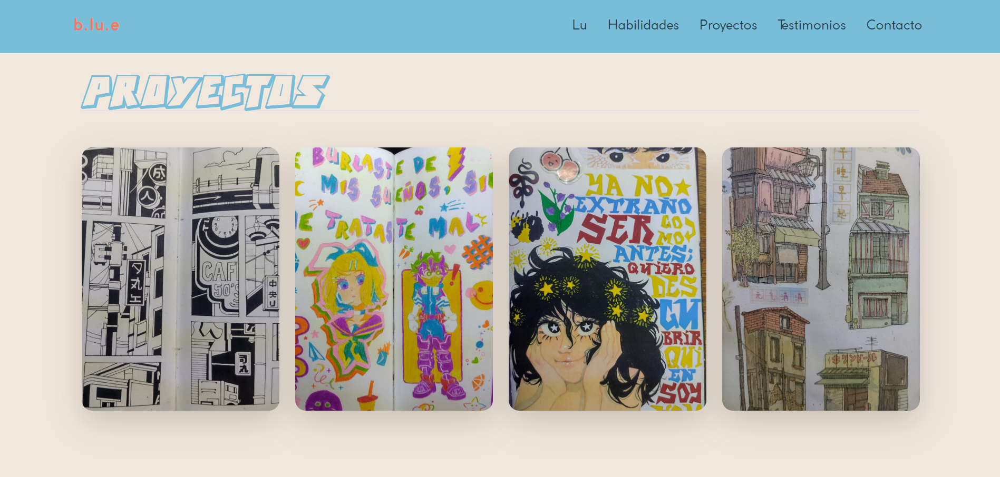
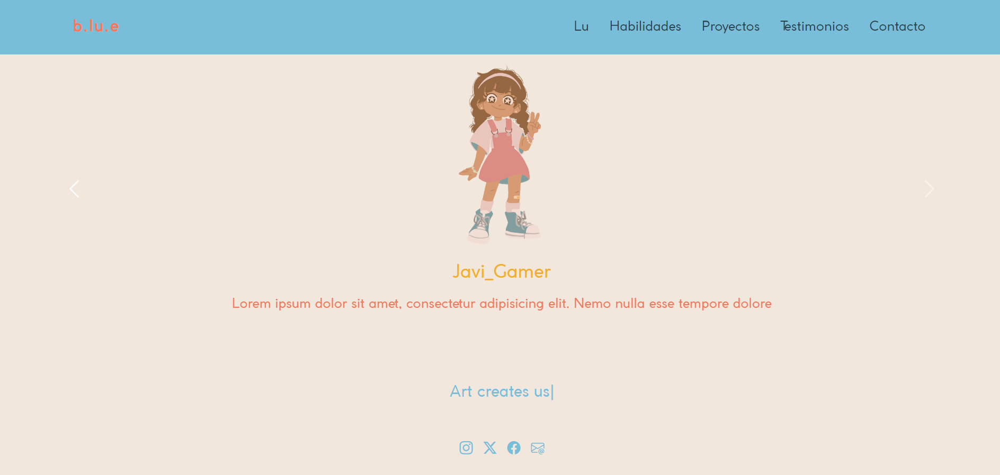

# Mi portafolio de habilidades TECNOLOCHICAS PRO

El presente proyecto es un portafolio desarrollado para poner en práctica las habiliades obtenidad denreo del bootcamp de desarrollo frontend de Technolochicas PRO.

Fue desarrollado con HTML, CSS y JS con el uso del framework UI, Boostrap utilizando ademas bibliotecas externas. 

La página es responsiva (adaptable a diferentes tamaños de pantalla) e incluye la presentación de la autora del proyecto.

[Proyecto desplegado ](https://zingy-pie-a14020.netlify.app/)

## Secciones del sitio

## Tecnologías 

* HTML 
* CSS
* Boostrap
* JavaScript

---

Desarrollado por [Ana Lucrecia](https://github.com/AnnaLucrecia) en [TECHNOLOCHICAS PRO](https://tecnolochicas.mx/)